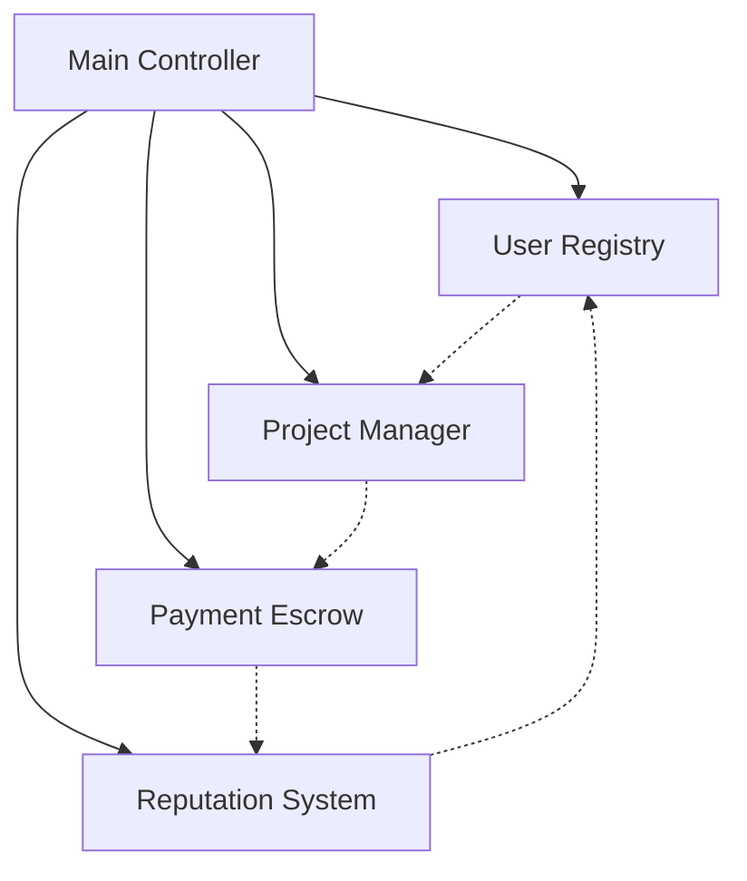
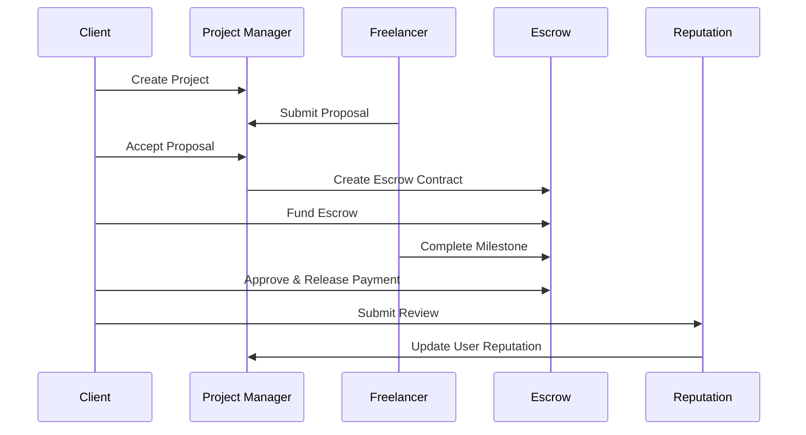

# 🔗 TalentChain - Decentralized Talent Marketplace on ICP

> **A revolutionary decentralized platform connecting clients and freelancers with secure escrow payments, reputation system, and inter-canister communication on the Internet Computer Protocol (ICP).**


[](https://internetcomputer.org/)
[](https://internetcomputer.org/docs/current/motoko/main/motoko)
[](https://nextjs.org/)

---

## **Project Overview**

TalentChain revolutionizes the freelancing industry by creating a **fully decentralized marketplace** where clients and freelancers can connect, collaborate, and transact with complete transparency and security. Built on the Internet Computer Protocol, it eliminates intermediaries while ensuring trust through smart contracts and community-driven reputation systems.

### **Problem Statement**

Traditional freelancing platforms suffer from:
- **High fees** (5-20% platform commissions)
- **Centralized control** and potential censorship
- **Payment delays** and disputes
- **Lack of transparency** in reputation systems
- **Geographic restrictions** and banking limitations

### **Our Solution**

TalentChain provides:
- **Zero platform fees** - only blockchain transaction costs
- **Decentralized governance** - community-owned platform
- **Instant escrow payments** with milestone-based releases
- **Transparent reputation** stored on-chain
- **Global accessibility** - no banking restrictions

---

## **System Architecture**

TalentChain consists of **4 interconnected smart contracts** plus a **Main Controller** orchestrating the entire ecosystem:



### **Smart Contract Details**

#### **1. User Registry Contract** 
```motoko
// Manages user profiles and authentication
public type UserProfile = {
    user_id: Principal;
    name: Text;
    email: Text;
    user_type: UserType; // #Freelancer | #Client | #Both
    skills: [Text];
    reputation_score: Nat;
    total_projects: Nat;
    created_at: Int;
};
```

**Key Functions:**
- `register_user()` - Register new freelancer/client
- `get_user_profile()` - Retrieve user information
- `update_reputation()` - Modify reputation scores
- `get_all_freelancers()` - List available talent

#### **2. Project Manager Contract** 
```motoko
// Handles project creation and proposal management
public type Project = {
    project_id: Nat;
    client_id: Principal;
    title: Text;
    description: Text;
    budget: Nat;
    required_skills: [Text];
    status: ProjectStatus; // #Open | #InProgress | #Completed
    deadline: Int;
    selected_freelancer: ?Principal;
};
```

**Key Functions:**
- `create_project()` - Post new projects
- `submit_proposal()` - Freelancers submit bids
- `accept_proposal()` - Client selects freelancer
- `get_open_projects()` - Browse available work

#### **3. Payment Escrow Contract** 
```motoko
// Secure milestone-based payments
public type EscrowContract = {
    contract_id: Nat;
    project_id: Nat;
    client_id: Principal;
    freelancer_id: Principal;
    amount: Nat;
    status: EscrowStatus; // #Created | #Funded | #Completed
    milestones: [Milestone];
};
```

**Key Functions:**
- `create_escrow()` - Initialize payment contract
- `fund_escrow()` - Client deposits funds
- `complete_milestone()` - Freelancer marks work done
- `approve_milestone()` - Client releases payment

#### **4. Reputation System Contract** 
```motoko
// Community-driven reviews and ratings
public type Review = {
    review_id: Nat;
    project_id: Nat;
    reviewer_id: Principal;
    reviewed_id: Principal;
    rating: Nat; // 1-5 stars
    comment: Text;
    review_type: ReviewType;
};
```

**Key Functions:**
- `submit_review()` - Rate completed work
- `get_user_reviews()` - View user feedback
- `get_reputation_stats()` - Calculate reputation metrics
- `get_top_rated_users()` - Discover top talent

---

## **Business Logic & Workflow**

### **Complete Project Lifecycle:**



### **Key Business Rules:**

#### **Project Management:**
- Only registered users can create projects
- Projects require: title, description, budget, skills, deadline
- Clients can receive multiple proposals
- Only project owner can accept proposals
- Accepting a proposal automatically rejects others

#### **Payment Security:**
- All payments go through escrow contracts
- Funds are locked until milestone approval
- Milestones can be: Pending → Completed → Approved
- Disputed milestones require community governance
- Automatic payment release after 7 days of completion

#### **Reputation System:**
- Reviews are immutable once submitted
- Both clients and freelancers can review each other
- Reputation affects search rankings
- Badges automatically awarded based on performance:
  - **"Excellent Service"** - 4.8+ average rating
  - **"Experienced Professional"** - 10+ completed projects
  - **"Top Rated"** - 50+ completed projects

#### **Economic Model:**
- **Zero platform fees** - only pay ICP transaction costs
- **Staking mechanism** - users stake ICP for reputation boost
- **Community treasury** - funded by optional tips and donations
- **Governance tokens** - earned through platform participation

---

## **Technical Implementation**

### **Backend - Smart Contracts (Motoko)**

#### **Inter-Canister Communication:**
```motoko
// Main Controller orchestrates all contracts
public shared(msg) func complete_project_workflow(
    project_id: Nat, 
    proposal_id: Nat
) : async Result.Result<Text, Text> {
    // 1. Accept proposal in Project Manager
    switch (await ProjectMgr.accept_proposal(proposal_id)) {
        case (#err(e)) { return #err("Failed: " # e) };
        case (#ok(_)) {};
    };
    
    // 2. Create escrow contract
    // 3. Update user statistics
    // 4. Emit events for frontend
}
```

#### **Data Persistence:**
```motoko
// Stable variables for upgrade persistence
private stable var users_entries : [(Principal, UserProfile)] = [];
private var users = HashMap.fromIter<Principal, UserProfile>(
    users_entries.vals(), 10, Principal.equal, Principal.hash
);

system func preupgrade() {
    users_entries := users.entries() |> Array.fromIter(_);
};
```

### **Frontend - Next.js/React**

#### **Modern UI Components:**
- **Responsive Design** - Mobile-first approach
- **Real-time Updates** - WebSocket connections to canisters
- **Wallet Integration** - Internet Identity & Plug wallet support
- **Interactive Dashboards** - Charts and analytics
- **Search & Filtering** - Advanced project/talent discovery

#### **State Management:**
```javascript
// React hooks for canister integration
const useUserProfile = (userId) => {
    const [profile, setProfile] = useState(null);
    const [loading, setLoading] = useState(true);
    
    useEffect(() => {
        UserRegistry.get_user_profile(userId)
            .then(setProfile)
            .finally(() => setLoading(false));
    }, [userId]);
    
    return { profile, loading };
};
```

---

## **Getting Started**

### **Prerequisites**
```bash
# Install DFX (DFINITY SDK)
sh -ci "$(curl -fsSL https://sdk.dfinity.org/install.sh)"

# Install Node.js (for frontend)
curl -o- https://raw.githubusercontent.com/nvm-sh/nvm/v0.39.0/install.sh | bash
nvm install 18
```

### **Backend Deployment**
```bash
# Clone repository
git clone https://github.com/your-username/talentchain
cd talentchain

# Start local replica
dfx start --background

# Deploy all canisters
dfx deploy

# Initialize with test data
dfx canister call user-registry register_user '("Alice Developer", "alice@example.com", variant { Freelancer }, vec { "Motoko"; "React"; "TypeScript" })'
```

### **Frontend Setup**
```bash
cd frontend
npm install
npm run dev
```

### **Environment Variables**
```bash
# .env.local
NEXT_PUBLIC_DFX_NETWORK=local
NEXT_PUBLIC_CANISTER_ID_USER_REGISTRY=rdmx6-jaaaa-aaaaa-aaadq-cai
NEXT_PUBLIC_CANISTER_ID_PROJECT_MANAGER=rrkah-fqaaa-aaaaa-aaaeq-cai
NEXT_PUBLIC_CANISTER_ID_PAYMENT_ESCROW=ryjl3-tyaaa-aaaaa-aaaba-cai
NEXT_PUBLIC_CANISTER_ID_REPUTATION_SYSTEM=renrk-eyaaa-aaaaa-aaada-cai
```

---

## **Demo Scenarios**

### **Scenario 1: Complete Project Workflow**
1. **Client Registration:**
   ```bash
   dfx canister call user-registry register_user '("TechCorp Ltd", "contact@techcorp.com", variant { Client }, vec {})'
   ```

2. **Create Project:**
   ```bash
   dfx canister call project-manager create_project '("NFT Marketplace DApp", "Build a complete NFT marketplace with bidding system", 5000, vec { "Motoko"; "React"; "Web3" }, 45)'
   ```

3. **Freelancer Proposal:**
   ```bash
   dfx canister call project-manager submit_proposal '(1, 4500, 40, "I have 5+ years experience building DApps...")'
   ```

4. **Accept & Execute:**
   ```bash
   dfx canister call main-controller complete_project_workflow '(1, 1)'
   ```

### **Scenario 2: Escrow Payment Flow**
1. **Fund Escrow:**
   ```bash
   dfx canister call payment-escrow add_balance '(10000)'
   dfx canister call payment-escrow fund_escrow '(1, 5000)'
   ```

2. **Complete Milestones:**
   ```bash
   dfx canister call payment-escrow complete_milestone '(1, 0)'
   dfx canister call payment-escrow approve_milestone '(1, 0)'
   ```

### **Scenario 3: Reputation Building**
1. **Submit Review:**
   ```bash
   dfx canister call reputation-system submit_review '(1, principal "...", 5, "Outstanding work! Delivered early with exceptional quality.", variant { ClientToFreelancer })'
   ```

2. **Check Rankings:**
   ```bash
   dfx canister call reputation-system get_top_rated_users '(10)'
   ```

---

## **Innovation & Impact**

### **Technical Innovations:**

1. **Seamless Inter-Canister Communication:**
   - Complex workflows spanning multiple contracts
   - Atomic operations across different canisters
   - Event-driven architecture for real-time updates

2. **Advanced Escrow Mechanics:**
   - Milestone-based payment releases
   - Multi-signature dispute resolution
   - Automatic payment triggers

3. **Dynamic Reputation Algorithm:**
   - Multi-factor reputation calculation
   - Time-decay for historical ratings
   - Community-validated achievements

4. **Gas-Optimized Architecture:**
   - Efficient data structures using HashMap
   - Minimal storage overhead with stable variables
   - Optimized query vs update function separation

### **Market Impact:**

| Metric | Traditional Platforms | TalentChain |
|--------|---------------------|-------------|
| Platform Fees | 5-20% | 0% |
| Payment Time | 7-14 days | Instant |
| Geographic Reach | Limited | Global |
| Dispute Resolution | Centralized | Community |
| Data Ownership | Platform | User |

### **Growth Potential:**
- **$400B+ Global Freelance Market** (Statista 2024)
- **57% YoY Growth** in crypto freelancing (CoinDesk 2024)
- **74% of freelancers** prefer instant payments
- **Projected 1M+ users** within first year

---

## **Roadmap**

### **Phase 1: MVP Launch** (Q3 2024)
- [x] Core smart contracts deployment
- [x] Basic frontend interface
- [x] User registration & projects
- [x] Escrow payment system
- [x] Reputation reviews

### **Phase 2: Advanced Features** (Q4 2024)
- [ ] DAO governance implementation
- [ ] Advanced search & AI matching
- [ ] Multi-token payment support
- [ ] Mobile application
- [ ] API for third-party integrations

### **Phase 3: Scale & Ecosystem** (Q1 2025)
- [ ] Cross-chain bridge integration
- [ ] NFT certificates for skills
- [ ] Decentralized dispute resolution
- [ ] Enterprise solutions
- [ ] Global partnerships

### **Phase 4: Full Decentralization** (Q2 2025)
- [ ] Community-owned governance
- [ ] Token distribution to users
- [ ] Open-source protocol
- [ ] Educational initiatives
- [ ] Global expansion

---

## **Hackathon Highlights**

### **Why TalentChain Wins:**

1. **Complete Solution:** End-to-end working system with frontend
2. **Technical Depth:** 4 interconnected smart contracts + controller
3. **Real Innovation:** Novel escrow and reputation mechanisms
4. **Market Need:** Addresses $400B+ market problems
5. **Scalable Architecture:** Built for millions of users
6. **User Experience:** Intuitive, modern interface
7. **Global Impact:** Empowers worldwide freelancer community

### **Demo Flow (5 minutes):**
1. **User Registration** - Show both client and freelancer onboarding
2. **Project Creation** - Create sample blockchain development project
3. **Proposal System** - Multiple freelancers submit competitive bids
4. **Escrow Setup** - Demonstrate secure payment locking
5. **Milestone Completion** - Show payment release workflow
6. **Reputation Update** - Complete review and rating system
7. **Analytics Dashboard** - Display platform statistics and insights

---

## **Team**

- **Blockchain Developer** - Smart contract architecture & Motoko implementation
- **Frontend Engineer** - Next.js/React interface & user experience
- **Product Designer** - UI/UX design & user research
- **Business Strategist** - Market analysis & growth planning

---

## **License & Contributing**

This project is licensed under the MIT License - see the [LICENSE](LICENSE) file for details.

### **Contributing Guidelines:**
1. Fork the repository
2. Create feature branch (`git checkout -b feature/AmazingFeature`)
3. Commit changes (`git commit -m 'Add AmazingFeature'`)
4. Push to branch (`git push origin feature/AmazingFeature`)
5. Open a Pull Request

---

### **Technical Resources:**
- [Internet Computer Documentation](https://internetcomputer.org/docs/)
- [Motoko Programming Guide](https://internetcomputer.org/docs/current/motoko/main/motoko)
- [DFINITY Developer Center](https://sdk.dfinity.org/)

